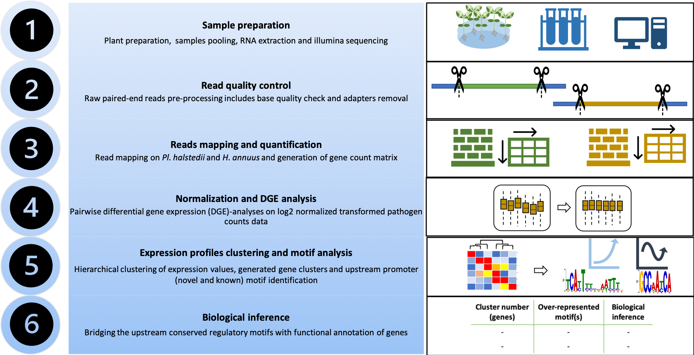
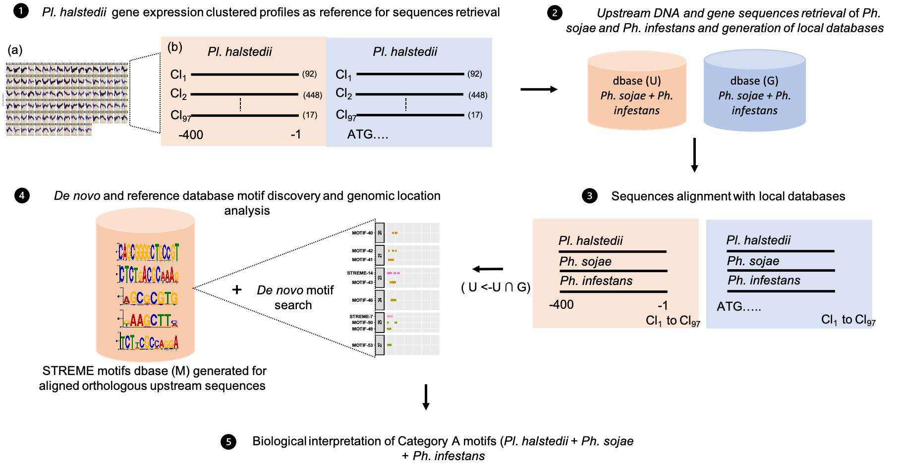
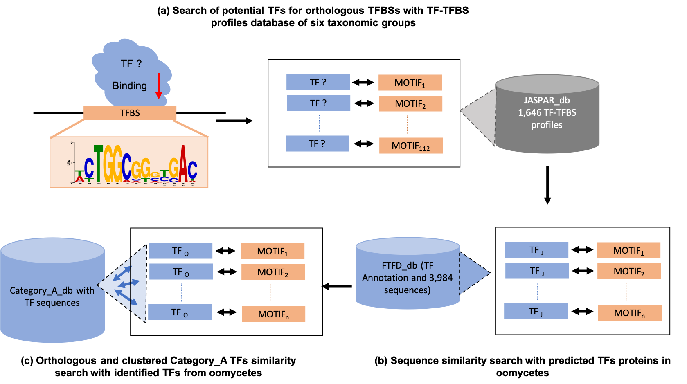

# **Transcriptional Regulation in Plant Pathogenic Oomycetes**

## **Overview**
Welcome to the repository for the research on **Transcriptional Regulation in Oomycetes**, part of a PhD thesis under the guidance of **Prof. Dr. Marco Thines**. This study explores the regulatory pathways controlling transcription in oomycetes, organisms that are pivotal in plant pathology and environmental biology. The research has been supported by a collaboration of esteemed institutions:

- **Senckenberg Biodiversity and Climate Research Centre (SBiK-F)**, Senckenberg Gesellschaft für Naturforschung, Frankfurt, Germany
- **Department of Biological Sciences**, Goethe University, Frankfurt, Germany
- **Center for Integrative Fungal Research (IPF)**, Frankfurt, Germany
- **LOEWE Centre for Translational Biodiversity Genomics (TBG)**, Frankfurt, Germany

The aim of this research is to illuminate the mechanisms underlying transcriptional regulation in oomycetes, using high-throughput sequencing and advanced bioinformatics. The repository includes code for data preprocessing, comprehensive analysis and visualization of promoter region, contributing to a better understanding of these organisms.

This project is divided into three main parts, each focused on a specific aspect of transcriptional regulation in oomycetes:

1. **Pl_halstedii_study**: Analysis and scripts related to _Plasmopara halstedii_.
2. **orthologs_motifs_study**: Discovery and analysis of conserved motifs in orthologous oomycete genomes.
3. **orthologs_TF_study**: Identification and analysis of transcription factors (TFs) across multiple oomycete genomes.

For a visual overview of each study, please refer to the following pipeline images:

- **Pl_halstedii_study**: 
- **orthologs_motifs_study**: 
- **orthologs_TF_study**: 

## **Directory Structure**
The repository follows an organized structure to streamline the computational workflow:

- **`data/`**: Houses datasets at different stages.
  - **`raw/`**: Original unprocessed data files.
  - **`processed/`**: Data that has been cleaned and transformed for downstrean gene expression analysis.
  - **`support/`**: Supporting files including **FASTA**, **GTF**, and **GFF** files essential for annotation.

- **`scripts/`**: Computational scripts for data analysis and pipeline execution.
  - **`R/`**: Scripts written in R for time-series gene expreession analysis and visualization.
  - **`python/`**: Python scripts for data parsing, cleaning and manipulation.
  - **`shell/`**: Shell scripts to automate workflows and perform batch tasks.
  - **`perl/`**: Perl scripts for targeted data processing requirements (eg. for MEME suite).

- **`results/`**: Contains generated outputs, tables and key analysis results.
- **`docs/`**: Project documentation, including notes, methodology and comments.
- **`figures/`**: Visualizations generated during analysis for publication and presentations.

## **Setup and Execution**
To get started with the workflows in this repository:

1. **Clone the repository**:
   ```bash
   git clone https://github.com/your-username/Transcriptional-regulation-in-oomycetes.git
   ```

2. **Install the required software** as listed in the Requirements section.

3. **Execute scripts**: Instructions to run individual analyses are provided in the **README** files located in the respective script subdirectories.

## **Requirements**
The following software, programming languages, and packages are required for the analysis:

### **Programming Languages**
- **Python**: For data processing
- **Perl**: Specific data manipulation tasks
- **R**: Statistical analysis and visualization
- **Bash**: Pipeline automation

### **Libraries and Packages**
- **Python**: `pandas`, `numpy`
- **R**: Bioconductor packages (consult individual scripts for specifics)

### **Software**
- **Trimmomatic**: Version 0.36 (for quality trimming)
- **STAR**: Version 2.5.3a (for RNA-seq alignment)
- **FeatureCounts**: Version 2.0.1 (for read quantification)
- **MEME Suite**: Version 5.2.0 (for motif discovery)
- **BLAST**: Version 2.12.0 (for sequence alignment)
- **Clustal Omega**: Version 1.2.4 (for multiple sequence alignment)

Ensure that all dependencies are installed and compatible with your system for smooth execution of the pipelines.

## **Usage**
Clone the repository to your local machine and navigate to the root directory:

```bash
git clone https://github.com/your-username/Transcriptional-regulation-in-oomycetes.git
```

Each subdirectory in the `scripts/` folder has detailed instructions in its **README** file for executing the specific analyses.

## **Funding**
This research was funded through various grants:

- **Sakshi Bharti (SB)** received funding via the **Deutscher Akademischer Austauschdienst (DAAD)** under the *Research Grants-Doctoral Programmes in Germany, 2017/18* (funding term 57299294), which provided critical support for this PhD project.
- **Marco Thines (MT)** was funded by the **LOEWE Centre for Translational Biodiversity Genomics (TBG)**, supported by the government of Hessen.

The funding bodies had no influence on study design, data analysis, interpretation, or publication decisions.

## **Acknowledgments**

This project has benefited from the use of OpenAI's ChatGPT for assistance in generating some of the documentation and scripts. Generative AI tools have been utilized for creating content and providing suggestions throughout the development of the repository.

## **Competing Interests**
The authors declare no competing interests. Funding support from DAAD and LOEWE TBG did not influence the research design, data collection, data interpretation, or preparation of this manuscript.

For additional information, please contact **Sakshi Bharti** at [sakshi.bharti@senckenberg.de](mailto:sakshi.bharti@senckenberg.de).

---


