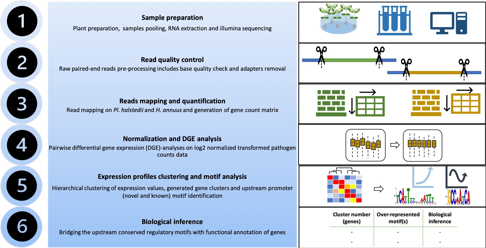
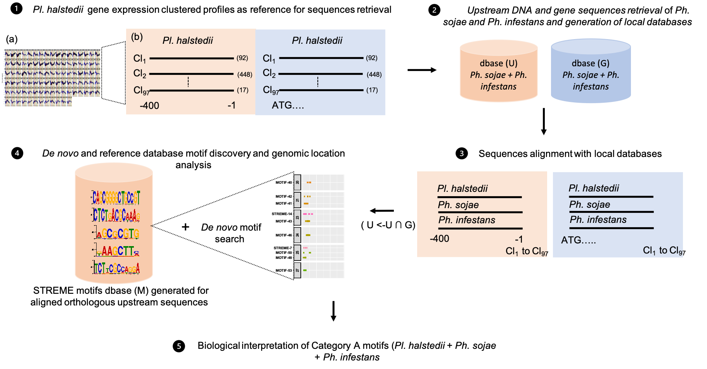
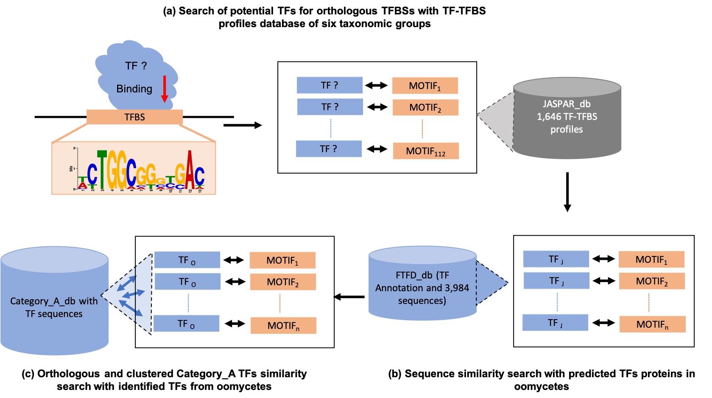

[](https://doi.org/10.5281/zenodo.15261655)

# Transcriptional Regulation in Plant Pathogenic Oomycetes

Computational workflows, scripts, documentation, and selected outputs from my PhD research on transcriptional regulation in plant pathogenic oomycetes.

This repository represents the bioinformatics and computational biology component of my doctoral work in the Thines group under the supervision of **Prof. Dr. Marco Thines**. The project investigates how oomycete plant pathogens regulate gene expression, promoter regions, effector-associated motifs, and transcription-factor-related regulatory programs during infection and development.

## Research Context

Oomycetes are fungus-like eukaryotic microorganisms that include many destructive plant pathogens. Species such as *Phytophthora* and downy mildew pathogens can cause major agricultural losses, yet their transcriptional regulation is still less understood than that of many model fungi or animals.

This PhD work combines transcriptomics, promoter analysis, comparative genomics, motif discovery, and custom pipeline development to study regulatory elements involved in oomycete pathogenicity and host interaction.

The work was conducted in collaboration with:

- **Senckenberg Biodiversity and Climate Research Centre (SBiK-F)**, Senckenberg Gesellschaft für Naturforschung, Frankfurt, Germany
- **Department of Biological Sciences**, Goethe University Frankfurt, Germany
- **Center for Integrative Fungal Research (IPF)**, Frankfurt, Germany
- **LOEWE Centre for Translational Biodiversity Genomics (TBG)**, Frankfurt, Germany

## Research Questions

This repository supports three connected research questions:

1. How does *Plasmopara halstedii* regulate gene expression across key infection and developmental time points?
2. Which promoter motifs and effector-associated regulatory patterns are conserved across oomycete genomes?
3. Which transcription factors and transcription-factor-associated motifs may contribute to conserved regulatory programs in plant pathogenic oomycetes?

## Project Modules

### 1. *Plasmopara halstedii* RNA-seq and Promoter Study

This module analyzes time-series RNA-seq data from *Plasmopara halstedii*.

Key workflow steps:

- Quality trimming of RNA-seq reads using **Trimmomatic**
- Host/pathogen read processing and alignment using **STAR**
- Gene-level quantification using **FeatureCounts**
- Differential gene expression analysis using **DESeq2**
- Time-point comparisons across infection and developmental stages
- PCA, normalization diagnostics, expression clustering, and profile visualization
- Promoter extraction for differentially expressed gene clusters
- De novo motif analysis of cluster-specific promoter regions using **MEME Suite**

Representative scripts:

- `scripts/shell/Pl_halstedii_study/1.1_trimming_mapping_host_pathogen.sh`
- `scripts/R/Pl_halstedii_study/1.2_DGE_analysis.R`
- `scripts/python/Pl_halstedii_study/1.3_Bg_promoters_search_phal.py`
- `scripts/python/Pl_halstedii_study/1.4_clusters_Promoters_search_coord.py`
- `scripts/shell/Pl_halstedii_study/1.5_motif_analysis_meme_suite.sh`

### 2. Ortholog and Conserved Motif Study

This module compares promoter and gene sequences across multiple oomycete genomes to identify conserved regulatory regions and motif categories.

Key workflow steps:

- Extraction of gene and promoter sequences from genome and annotation files
- Promoter retrieval from upstream genomic coordinates, including strand-aware reverse-complement handling
- Local BLAST searches for conserved gene and promoter clusters
- Extraction of common upstream regions from conserved genes
- Motif discovery and motif enrichment analysis using **MEME Suite**
- Assignment of motif conservation categories across orthologous groups
- Integration of effector-related sequence information for pathogenicity-focused interpretation

Representative scripts:

- `scripts/python/orthologs_motifs_study/2.1_clusters_gene_extractor.py`
- `scripts/python/orthologs_motifs_study/2.2_promoter_extractor_from_genome.py`
- `scripts/python/orthologs_motifs_study/2.3_clusters_promoter_extractor.py`
- `scripts/python/orthologs_motifs_study/2.4_gene_extractor_from_genome.py`
- `scripts/shell/orthologs_motifs_study/2.8_run_blast_clusters.sh`
- `scripts/shell/orthologs_motifs_study/2.11_motif_analysis.sh`
- `scripts/shell/orthologs_motifs_study/2.12_Category_assignment.sh`

### 3. Orthologous Transcription Factor Study

This module investigates transcription-factor-related motifs and conserved TF signals across oomycete genomes.

Key workflow steps:

- Motif comparison against **JASPAR** using **Tomtom**
- Extraction and parsing of JASPAR motif information
- Protein-sequence retrieval and formatting for comparative analysis
- BLASTp searches against the **Fungal Transcription Factor Database (FTFD)**
- Identification of homologous transcription-factor-related candidates
- Integration of TF motif evidence with promoter and effector analyses

Representative scripts:

- `scripts/shell/orthologs_TF_study/3.1_motif_analysis_against_jaspar.sh`
- `scripts/python/orthologs_TF_study/3.2_extract_jaspar_info.py`
- `scripts/python/orthologs_TF_study/3.3_extract_protein_info.py`
- `scripts/shell/orthologs_TF_study/3.5_blast_againts_FTFD.sh`

## Workflow Figures

### *Plasmopara halstedii* Study



### Ortholog Motif Study



### Ortholog Transcription Factor Study



## Key Bioinformatics Skills Demonstrated

This repository highlights skills gained and applied during my PhD:

- **RNA-seq analysis:** read trimming, alignment, feature counting, count-matrix preparation, normalization, differential expression analysis, and interpretation of time-series transcriptomic data
- **R and Bioconductor:** DESeq2, DEGreport, ggplot2, pheatmap, clusterProfiler, tidyverse-style data handling, PCA, heatmaps, expression profiles, and publication-oriented plots
- **Python data engineering:** FASTA/GFF/GTF parsing, coordinate-based sequence extraction, promoter extraction, tabular data processing, result integration, and workflow-specific file generation
- **Comparative genomics:** ortholog search, conserved gene and promoter analysis, BLAST-based sequence comparison, and cross-species regulatory motif interpretation
- **Motif discovery and annotation:** MEME, STREME/FIMO-style motif workflows, Tomtom motif comparison, JASPAR matching, background promoter modeling, and motif conservation categorization
- **Transcription factor analysis:** TF candidate retrieval, motif-to-protein interpretation, FTFD-based comparison, and integration of TF evidence with promoter regulation
- **Effector biology:** analysis of effector-associated sequences and motifs relevant to oomycete pathogenicity and host-pathogen interaction
- **Pipeline automation:** Bash workflow orchestration, reproducible folder structures, command-line tool integration, and multi-step computational analysis design
- **Research documentation:** method documentation, reproducibility notes, script-level comments, pipeline figures, result interpretation, and citation-ready repository organization
- **Scientific communication:** translating complex biological and computational workflows into structured documentation for researchers and reviewers

## Repository Structure

```text
.
├── data/
│   ├── raw/          # Raw or externally obtained input data placeholders and notes
│   ├── processed/    # Processed count matrices and intermediate analysis inputs
│   └── support/      # Reference/support files such as FASTA, GTF, and GFF notes
├── doc/              # Methodology, data, code, results, and reference documentation
├── figures/          # Pipeline figures for the three major studies
├── results/          # Generated outputs, tables, plots, and motif-analysis results
├── scripts/
│   ├── R/            # Differential expression, clustering, and visualization scripts
│   ├── python/       # Sequence extraction, parsing, and data-processing scripts
│   ├── shell/        # Pipeline automation, BLAST, alignment, and motif-analysis scripts
│   └── perl/         # MEME-compatible background model utility script
├── INSTALL.md        # Installation and dependency notes
├── ENVIRONMENT.md    # Environment information
├── CITATION.md       # Citation guidance
└── README.md
```

## Methods and Tools

### Programming Languages

- **R** for statistical analysis, differential expression, clustering, and visualization
- **Python** for sequence parsing, promoter extraction, tabular processing, and workflow integration
- **Bash** for pipeline automation and command-line bioinformatics tools
- **Perl** for MEME-related sequence background processing

### Core Bioinformatics Tools

- **Trimmomatic** v0.36 for read trimming
- **STAR** v2.5.3a for RNA-seq alignment
- **FeatureCounts** v2.0.1 for gene-level quantification
- **DESeq2** for differential expression analysis
- **MEME Suite** v5.2.0 for motif discovery and motif comparison
- **BLAST** v2.12.0 for sequence similarity searches
- **Clustal Omega** v1.2.4 for multiple sequence alignment
- **JASPAR** for transcription-factor motif comparison
- **FTFD** for transcription-factor-related protein comparison

## Getting Started

Clone the repository:

```bash
git clone https://github.com/sakshianil/Transcriptional_regulation_oomycetes.git
cd Transcriptional_regulation_oomycetes
```

Review the installation guide:

```bash
less INSTALL.md
```

Read the study documentation:

```bash
ls doc/
```

Run scripts from the relevant study folders after updating local paths and installing required dependencies. Many scripts were developed for a research/HPC-style environment and may contain project-specific paths that need to be adapted before reuse.

## Reproducibility Notes

- The repository is organized to document the computational workflows behind the thesis research.
- Some raw sequencing files and large external reference datasets may not be stored directly in GitHub because of size, licensing, or data-source restrictions.
- Scripts are grouped by study and language to make the analysis logic easier to inspect and reproduce.
- Where scripts use local absolute paths, users should update paths to match their environment.
- Generated outputs are organized under `results/`; documentation files in `doc/` explain methodology, data, code, results, and references.

## Citation

If you use or refer to this repository, please cite the Zenodo DOI:

[](https://doi.org/10.5281/zenodo.15261655)

Additional citation information is available in [CITATION.md](CITATION.md).

## Funding

This PhD research was supported by:

- **Deutscher Akademischer Austauschdienst (DAAD)**, Research Grants - Doctoral Programmes in Germany, 2017/18, funding term 57299294, awarded to Sakshi Bharti
- **LOEWE Centre for Translational Biodiversity Genomics (TBG)**, supported by the government of Hessen

The funding bodies had no influence on study design, data analysis, interpretation, or publication decisions.

## Acknowledgments

I thank Prof. Dr. Marco Thines, collaborators, institutional partners, and research colleagues who supported this PhD project. This repository also documents the computational work carried out across multiple stages of the project, from raw data processing to comparative regulatory analysis.

Some documentation and code comments were improved with the assistance of generative AI tools. Scientific design, data interpretation, and responsibility for the repository remain with the author.

## Competing Interests

The authors declare no competing interests. Funding support from DAAD and LOEWE TBG did not influence the research design, data collection, data interpretation, or preparation of this manuscript.

## Contact

**Primary email:** [sbbinfo90@gmail.com](mailto:sbbinfo90@gmail.com)  
**Institutional email:** [sakshi.bharti@senckenberg.de](mailto:sakshi.bharti@senckenberg.de), valid until **June 30, 2026**

For questions about the thesis workflows, code, documentation, or repository reuse, please contact Sakshi Bharti using the primary email above.
