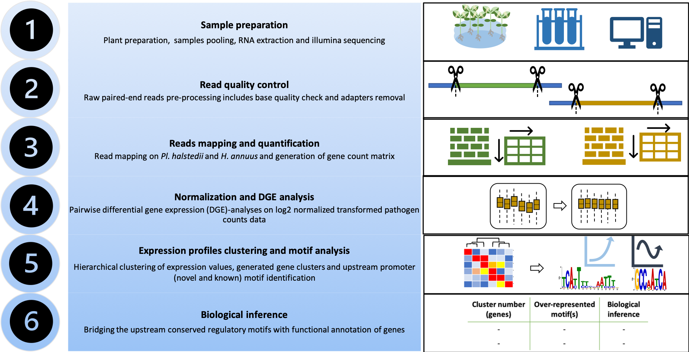

# Methodology

## Data Preprocessing
The raw data is cleaned and normalized to remove any inconsistencies.

## Differential Expression Analysis
Differential expression analysis is performed using DESeq2, identifying genes that are significantly up- or down-regulated.

## Clustering
Gene expression profiles are clustered to identify groups of co-expressed genes.

## Motif Discovery
Motif discovery is performed using MEME to find common regulatory elements in the promoter regions of co-expressed genes.

