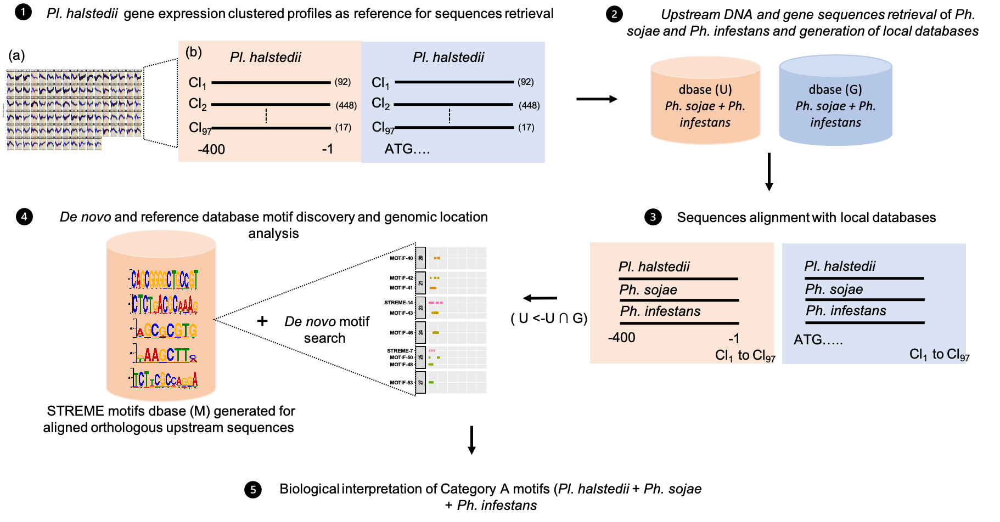
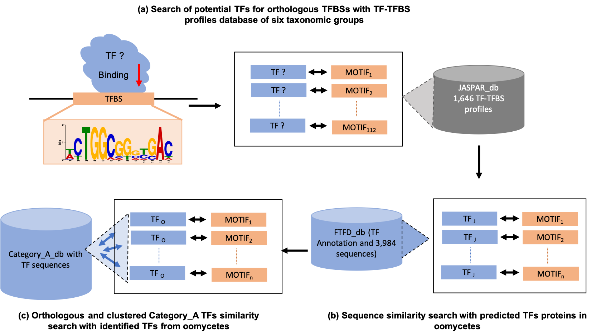

# Methodology

## Sample preparation

## Data Preprocessing

### Read Quality Control
The raw sequencing data is initially assessed for quality using tools such as FastQC. This step helps identify issues like low-quality reads, adapter contamination, and GC bias. Based on the quality reports, the data is cleaned using tools like Trimmomatic or Cutadapt to trim adapters, remove low-quality bases, and filter out poor-quality reads. The cleaned data is then normalized to ensure consistency across samples, which is crucial for accurate downstream analysis.

### Reads Mapping and Quantification
The cleaned reads are mapped to the reference genome using aligners like HISAT2 or STAR. This step translates the raw reads into genomic coordinates, enabling the quantification of gene expression. The resulting alignment files (BAM/SAM) are processed to count the number of reads mapping to each gene using tools such as HTSeq or featureCounts. This generates a count matrix that represents the expression levels of genes across different samples.

### Normalization
Normalization is a critical step to account for differences in sequencing depth and other technical variations between samples. Methods such as DESeq2 or edgeR are used to normalize the count data, ensuring that comparisons of gene expression levels across samples are accurate and meaningful. Normalization typically involves scaling the raw counts to account for library size and other factors, resulting in a set of normalized expression values that can be used for differential expression analysis and other downstream applications.

## Differential Expression Analysis
Differential expression analysis is performed using DESeq2, identifying genes that are significantly up- or down-regulated.

## Clustering
Gene expression profiles are clustered to identify groups of co-expressed genes.

## Motif Discovery
Motif discovery is performed using MEME to find common regulatory elements in the promoter regions of co-expressed genes.

